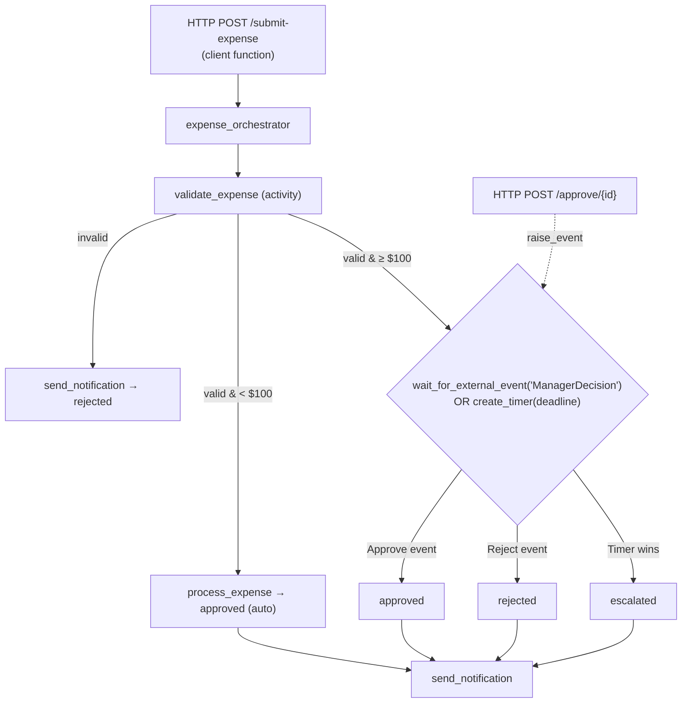
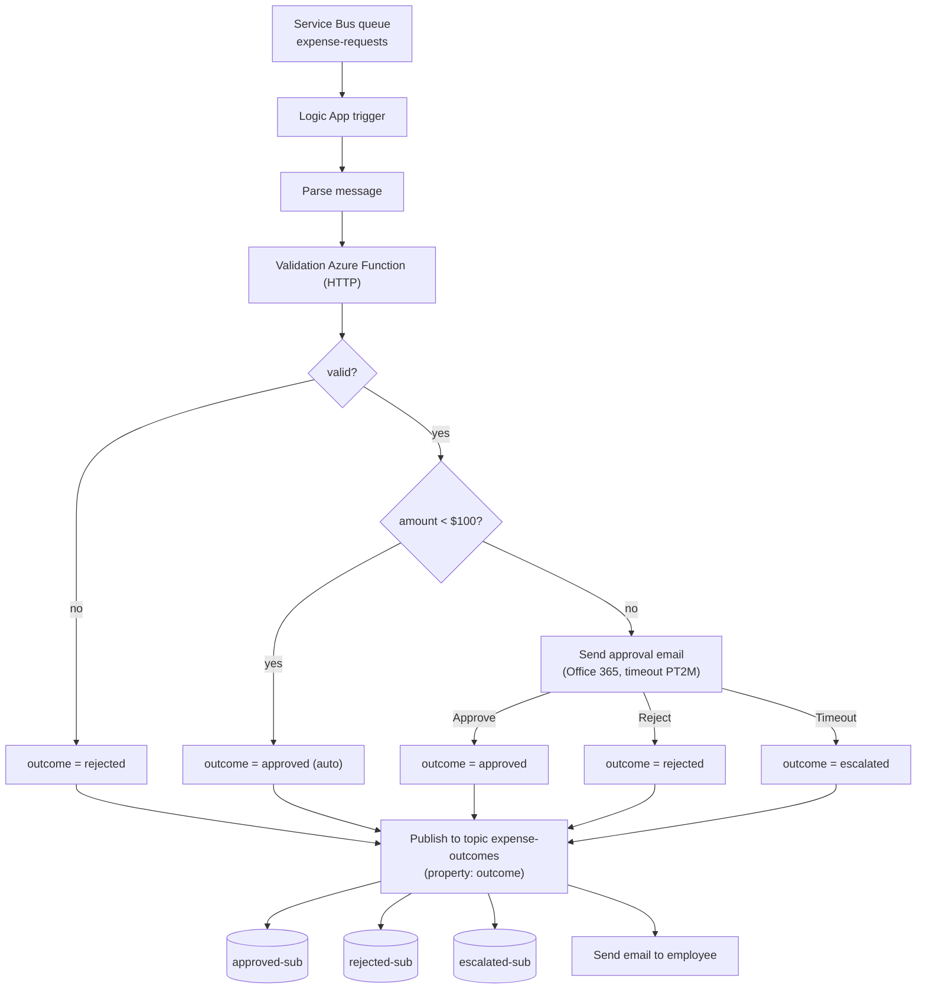

# Expense Approval Workflow - Dual Implementation (Durable Functions vs. Logic Apps + Service Bus)

| | |
|---|---|
| **Name** | Divyang Lodariya |
| **Student Number** | 041267824 |
| **Course** | CST8917 - Serverless Applications |
| **Assignment** | Assignment 2 - Compare & Contrast |
| **Date** | August 2, 2026 |

---

## 1. Overview

This project builds the **same business workflow twice**, using two different Azure serverless approaches, so we can compare them from real experience:

- **Version A - Azure Durable Functions** (code-first orchestration, Python).
- **Version B - Azure Logic Apps + Azure Service Bus** (visual / low-code orchestration).

Both implement an **expense approval pipeline** with these rules:

| Rule | Behaviour |
|---|---|
| **Input** | employee name, employee email, amount, category, description, manager email |
| **Validation** | Reject if any field is missing or the category is invalid. Valid: `travel, meals, supplies, equipment, software, other` |
| **Auto-approve** | Amount **under $100** is approved automatically (no manager needed) |
| **Manager approval** | Amount **$100 or more** waits for a manager decision |
| **Timeout** | If no manager decision arrives in time, the expense is auto-approved and flagged **`escalated`** |
| **Notification** | The employee is emailed the final outcome (approved / rejected / escalated) |

---

## 2. Version A - Durable Functions

### What it is
A Python v2 Durable Functions app. An HTTP **client** function starts an **orchestrator**, which coordinates **activity** functions. The manager wait is handled with the built-in **Human Interaction pattern**: the orchestrator waits for an external event *or* a durable timer, whichever fires first.

### Architecture



### Key design decisions
- **Orchestrator vs. activities split.** The orchestrator only decides *what happens next*; all real work (validation, processing, notification) lives in activities. This keeps the orchestrator **deterministic**, which Durable Functions requires because it replays history on every step.
- **Timeout with a durable timer.** `context.wait_for_external_event("ManagerDecision")` and `context.create_timer(deadline)` are raced with `context.task_any([...])`. Manager responds → we honour it; timer wins → `escalated`. No polling, no `sleep`.
- **Simulated email.** On the CloudLabs student tenant, sending real email from code (Office 365 SMTP) is blocked, so the notification activity logs the message and returns it in the orchestration output. Version B sends the real email. This trade-off is intentional and documented.

### Challenges
- **Core Tools ignored the virtual environment** and tried to use a global Python 3.14, which crashed `func start` (`Destination is too short`). Fixed by pinning `languageWorkers__python__defaultExecutablePath` to the `.venv` interpreter.
- **Azurite** must be running for local state (blob/queue/table).
- **GitHub push protection** blocked a commit because Azurite's emulator files contained function keys - fixed with a proper `.gitignore`.

### Test scenarios (`test-durable.http`)
All six pass locally: under-$100 auto-approve, manager approve, manager reject, timeout→escalated, missing fields, invalid category.

---

## 3. Version B - Logic Apps + Service Bus

### What it is
A message arrives in a **Service Bus queue**; a **Logic App** validates it (via an **Azure Function**), applies the rules, publishes the result to a **Service Bus topic** with filtered subscriptions, and emails the employee.

### Architecture



### How the manager approval step was handled
Logic Apps has **no native human-interaction pattern**. I used the **Office 365 "Send approval email"** action, which is a *webhook* action: it pauses the workflow and waits for the manager to click **Approve/Reject** in the email. I set its **Timeout = `PT2M`** (2 minutes) and configured the next action's **run-after** to fire on `Succeeded`, `TimedOut`, *and* `Failed`. An expression then maps the result:
- clicked **Approve** → `approved`
- clicked **Reject** → `rejected`
- no response (timed out) → `escalated`

This reproduces the timeout/escalation behaviour that Durable Functions gives for free.

### Filtered subscriptions (routing)
The topic `expense-outcomes` has three subscriptions, each with a SQL filter on a custom message property `outcome`:
`approved-sub → outcome = 'approved'`, `rejected-sub → outcome = 'rejected'`, `escalated-sub → outcome = 'escalated'`.
After running all six scenarios the counts were **approved = 3, rejected = 3, escalated = 1**, confirming routing works.

### Challenges
- **Boolean comparison trap:** `string(true)` returns `"True"` (capital T) but I compared to `"true"`, so every valid expense was wrongly rejected. Fixed with `toLower(...)`.
- **Service Bus `BadRequest`:** the connector needs `ContentData` as **base64**; I was sending decoded JSON. Fixed by forwarding the trigger's original base64.
- **Custom property format:** the routing property had to be a real JSON object, built with `json(concat('{"outcome":"', variables('outcome'), '"}'))`.
- **Run-after for timeout:** without adding `TimedOut`/`Failed`, the escalation path dead-ended.

---

## 4. Comparison Analysis

### Development experience
Version A was **faster to build once the toolchain worked**, but the toolchain fought back first: Core Tools grabbed the wrong Python and crashed on startup. After that, writing the orchestrator was quick and natural - the whole workflow is one readable Python file that lives in Git and is easy to reason about. Version B needed **no environment setup**, but the build was **click-heavy and full of silent traps**. Nothing errors when you compare a boolean to a string, or send plain text where base64 is expected - the run simply does the wrong thing, and you only find out by reading run history. I hit five separate design-time bugs in Version B (boolean casing, numeric comparison, base64 content, run-after, property format) versus effectively one environment bug in Version A. That said, Version B's designer makes the *shape* of the workflow obvious at a glance, which Version A's code does not.

### Testability
Version A is clearly **more testable**. I ran the entire thing locally against Azurite and drove all six scenarios from a `test-durable.http` file, with no cloud resources at all. The activity functions are plain Python, so they could be unit-tested with `pytest` directly. Version B is **hard to test locally** - the Logic App is a cloud-only resource, and testing means sending real messages to a real Service Bus queue and inspecting run history by hand. There is no practical way to write automated tests for the Logic App itself, which matters for regression safety.

### Error handling
Version A gives **automatic activity retries** and lets you wrap logic in `try/except`, with the orchestrator replay model guaranteeing consistent state after failures. Version B handles failure through **run-after conditions** and per-connector retry policies. Run-after is powerful and visual, but it is also easy to get wrong (my escalation broke precisely because a run-after didn't include `TimedOut`). Version A's model gave me more confidence that a mid-run failure would recover correctly.

### Human interaction pattern
This is where the two differ most. Version A treats "wait for a human, with a timeout" as a **first-class, native feature** - one `task_any` over an event and a durable timer. It is elegant and hard to get wrong. Version B has **no native equivalent**; I had to lean on the Office 365 approval-email webhook plus a timeout plus run-after wiring to fake it. It works, and the approval email is arguably a nicer end-user experience out of the box, but it is a **workaround**, not a language feature, and it depends on a specific connector.

### Observability
Version B wins decisively here. Its **run history is a visual, step-by-step timeline** - I can click any action, see its exact inputs and outputs, and immediately spot which branch ran and why. That is how I diagnosed every one of my Version B bugs. Version A relies on console logs locally and Application Insights in the cloud; the information is all there, but it is **less visual and less immediate** than clicking through a Logic App run.

### Cost (assumptions stated; figures from Azure Pricing Calculator public rates, 2026)
**Assumptions:** one expense = one workflow run; Version A ≈ 10 function executions/run; Version B ≈ 10 built-in + 5 standard-connector actions/run; Service Bus **Standard** tier (needed for topics).

| Volume | Version A (Durable Functions) | Version B (Logic Apps + Service Bus) |
|---|---|---|
| **~100/day** (≈3k/mo) | ~**$0-1** (within the free grant of 1M exec + 400k GB-s) | ~**$12** (≈$10 Service Bus base + ~$2 actions) |
| **~10,000/day** (≈300k/mo) | ~**$5-15** (≈3M exec, mostly small billable overage + storage) | ~**$250-300** (standard-connector actions dominate: ~1.5M × $0.000125 ≈ $188 + built-in + Service Bus) |

Durable Functions is **much cheaper**, and the gap widens at scale because Logic Apps bills **per action** and the managed connectors (Service Bus, Office 365) are the priciest actions.

---

## 5. Recommendation

**If a team asked me to build this for production, I would choose Version A – Durable Functions.** Three reasons decided it. First, **human interaction with a timeout is native** — the exact requirement of this workflow is a first-class feature, not a workaround, so there is less to get wrong and less to maintain. Second, **testability**: I could run and verify the whole pipeline locally and could add real unit tests, which is essential for a workflow that touches money and must not regress. Third, **cost**: at 10,000 expenses/day the Logic Apps bill is roughly an order of magnitude higher because it charges per action and per managed-connector call. Durable Functions also keeps the entire workflow in source control as one reviewable file, which fits normal engineering practice.

**I would choose Version B – Logic Apps instead when the team is not developer-heavy, or when the workflow is mostly gluing SaaS systems together.** Logic Apps needs no local toolchain, its approval email and email-sending connectors work out of the box (no code, no SMTP fights), and its visual run history is the best debugging experience I had in this project. For a low-volume internal approval flow owned by an operations or business team — rather than engineers — its speed to build and clarity to non-developers would outweigh the higher cost and weaker testability. In short: **code-first Durable Functions for scale, correctness, and cost; visual Logic Apps for low-code teams and rich built-in integrations.**

---

## 6. Repository Structure

```
CST8917-FinalProject-DivyangLodariya/
├── README.md
├── version-a-durable-functions/
│   ├── function_app.py
│   ├── requirements.txt
│   ├── host.json
│   ├── local.settings.example.json
│   └── test-durable.http
├── version-b-logic-apps/
│   ├── function_app.py            # validation function
│   ├── requirements.txt
│   ├── local.settings.example.json
│   ├── logic-app-workflow.json    # exported Logic App definition
│   └── screenshots/
└── presentation/
    ├── slides.pptx
    └── video-link.md
```

## 7. How to Run

**Version A (local):**
```bash
cd version-a-durable-functions
python -m venv .venv && .\.venv\Scripts\Activate.ps1
pip install -r requirements.txt
# start Azurite, then:
func start
# drive tests from test-durable.http
```

**Version B (Azure):** send a JSON message to the `expense-requests` Service Bus queue (Service Bus Explorer). The Logic App picks it up, validates via the deployed function, routes the outcome to the topic subscriptions, and emails the employee.

## 8. Evidence (screenshots/)

| File | Shows |
|---|---|
| `Function running locally.png` | Version A running on Azure Functions Core Tools |
| `scenario 1.png` | Version A auto-approve output |
| `Run history.png` | Version B — all runs succeeded |
| `scenario 2–5.png` | Version B outcome emails (approved / rejected / escalated) |
| `scenario 4.png` | Version B escalation (timeout) email |
| `service bus topic.png` | Topic subscription counts (approved 3 / rejected 3 / escalated 1) |

## 9. References
- Azure Durable Functions overview - https://learn.microsoft.com/azure/azure-functions/durable/durable-functions-overview
- Human interaction & durable timers - https://learn.microsoft.com/azure/azure-functions/durable/durable-functions-timers
- Azure Logic Apps documentation - https://learn.microsoft.com/azure/logic-apps/logic-apps-overview
- Azure Service Bus topics & subscriptions - https://learn.microsoft.com/azure/service-bus-messaging/service-bus-queues-topics-subscriptions
- Service Bus subscription filters - https://learn.microsoft.com/azure/service-bus-messaging/topic-filters
- Office 365 Outlook "Send approval email" - https://learn.microsoft.com/connectors/office365/
- Azure Pricing Calculator - https://azure.microsoft.com/pricing/calculator/

## 10. AI Disclosure
AI (Claude) was used as a coding and learning assistant throughout this project: to help scaffold the Durable Functions and validation code, to guide the Logic App design in the portal, to diagnose errors. All code was reviewed, run, and tested by me; all Azure resources were built and all screenshots captured by me. The design decisions, testing, and final wording reflect my own understanding.
