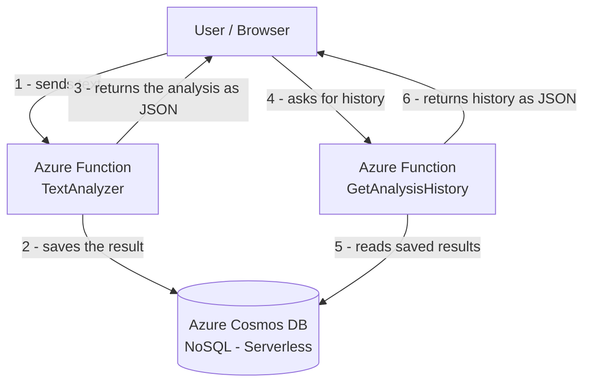

# Serverless Text Analyzer (Azure Functions + Cosmos DB)

This is my Lab 1 project for CST8917 (Serverless Applications).

It is a small serverless app built with **Azure Functions** in **Python**. You send it
some text, and it tells you stats about that text (like how many words and sentences it has).
Every result also gets **saved into a database (Azure Cosmos DB)**, so I can look at the
history of everything that was analyzed.

There are two endpoints:

1. **TextAnalyzer** - analyzes the text you send and saves the result.
2. **GetAnalysisHistory** - shows the past results that were saved, newest first.

---

## Demo Video

Here is my walkthrough video where I explain the code and show it running live in Azure:

▶️ **[Watch the demo on YouTube](https://youtu.be/LBH-AAbdxpw?si=E-bUJ0uiQSNw9q0Z)**

> Replace the link above with your actual YouTube video URL.

---

## How it works (diagram)



So when I call **TextAnalyzer**, it analyzes my text, saves it to Cosmos DB, and sends the
result back. When I call **GetAnalysisHistory**, it reads everything that was saved and
sends it back to me.

---

## Tech I used

- **Azure Functions** (Python v2 model) - the serverless compute
- **Azure Cosmos DB for NoSQL** (serverless mode) - the database
- **Python 3.12**
- **Flex Consumption plan** - pay only when the function runs
- **Region:** Canada Central

---

## The endpoints (with examples)

### 1. TextAnalyzer

Send it text and it gives you back the stats and saves them.

```
GET /api/TextAnalyzer?text=Serverless computing is amazing. It scales automatically.
```

Example response:

```json
{
  "id": "c7d69ba1-a24c-409e-a5b0-607bce181f56",
  "analysis": {
    "wordCount": 7,
    "characterCount": 57,
    "characterCountNoSpaces": 51,
    "sentenceCount": 2,
    "paragraphCount": 1,
    "averageWordLength": 7.3,
    "longestWord": "automatically.",
    "readingTimeMinutes": 0.0
  },
  "metadata": {
    "analyzedAt": "2026-06-10T02:21:49.106079+00:00",
    "textPreview": "Serverless computing is amazing. It scales automatically."
  },
  "saved": true
}
```

The `"saved": true` part tells me the result actually got saved into the database.

### 2. GetAnalysisHistory

Shows the saved results, newest first. You can also add a limit.

```
GET /api/GetAnalysisHistory
GET /api/GetAnalysisHistory?limit=5
```

Example response:

```json
{
  "count": 2,
  "results": [
    {
      "id": "579c50f9-5aaa-4a22-825a-05079fccff71",
      "analysis": { "wordCount": 8, "sentenceCount": 1 },
      "metadata": { "analyzedAt": "2026-06-10T02:49:03.845483+00:00" }
    }
  ]
}
```

---

## How to run it on my own computer

1. Install the packages:
   ```
   pip install -r requirements.txt
   ```
2. Put my Cosmos DB connection string in `local.settings.json` as `COSMOS_CONNECTION_STRING`.
3. Start **Azurite** (the local storage emulator).
4. Press **F5** in VS Code to run it (or use `func host start`).
5. Test it in the browser:
   ```
   http://localhost:7071/api/TextAnalyzer?text=Hello world
   ```

---

## How I deployed it

I deployed it to **Azure Functions** straight from VS Code. The Cosmos DB connection string
is stored as an **Application Setting** in Azure (called `COSMOS_CONNECTION_STRING`), so the
secret is **never** inside my code.

---

## Security notes

- My connection string is kept in `local.settings.json` (which is in `.gitignore`) on my
  computer, and in Azure Application Settings in the cloud. It is **never committed to GitHub**.
- The `limit` value in GetAnalysisHistory is checked to make sure it is a number, so nobody
  can mess with the database query.
- For this lab I used Secrets (connection string) for simplicity. In a real production app I
  would use a **Managed Identity** instead, so there is no connection string to leak at all.

---

## Why I picked Cosmos DB

My results are JSON with nested data, and Cosmos DB for NoSQL stores JSON directly without
needing a schema. Serverless mode means I only pay for what I use. I explain my full reasoning
(and the other databases I considered) in **[DATABASE_CHOICE.md](./DATABASE_CHOICE.md)**.

---

## Author

**Divyang Lodariya**
Cloud Development and Operations - Algonquin College
GitHub: [Divyang2599](https://github.com/Divyang2599)
