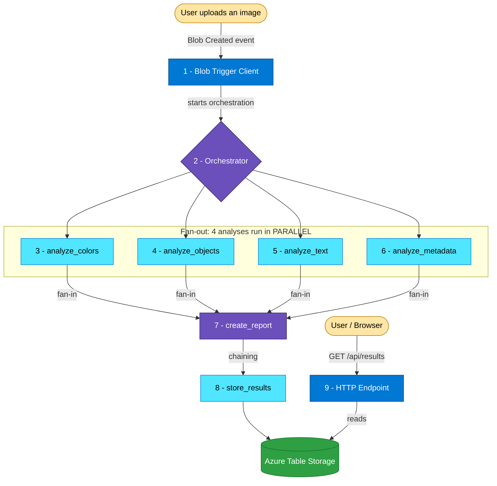

# Smart Image Analyzer

A serverless app that **automatically analyzes any image the moment it is uploaded** - built with **Azure Durable Functions** in Python.

**Course:** CST8917 - Serverless Applications · Lab 2  
**Author:** Divyang Lodariya - Cloud Development & Operations, Algonquin College  
**GitHub:** [@Divyang2599](https://github.com/Divyang2599)  

---

## Demo Video

**Watch the project running (local + cloud):** [PASTE YOUR YOUTUBE LINK HERE]

The video shows the full pipeline: uploading an image, the four analyses firing **in parallel** in the live logs, and the final report returned from the HTTP endpoint - both locally and deployed on Azure.

---

## What This Project Does

Think of it like a small **factory line** for images. A file arrives, and here is what happens:

1. **The doorbell** notices an image was uploaded and says *"A file arrived - start the line."*
2. **The manager** takes over and hands the image to **four workers at the same time**.
3. **The four workers** each do one job in parallel:
   - one finds the **dominant colors**
   - one **detects objects** (mock - placeholder for a real AI vision service)
   - one **reads text / OCR** (mock - placeholder for a real OCR service)
   - one reads the **real metadata** (width, height, format, EXIF)
4. **The report builder** waits for all four to finish, then combines their answers into one report.
5. **The filing cabinet** saves that report to Azure Table Storage.
6. **The front desk** lets anyone read the saved report through a web link.

Upload an image → get a full analysis back automatically.

---

## The Pattern (the heart of the lab)

This lab is about two Durable Functions patterns working together:

**Fan-out / Fan-in - *doing many things at once.***
The orchestrator sends the image to **four workers simultaneously** instead of one after another. It then **waits for all four** to finish before moving on. In code this is `context.task_all([...])`.

**Chaining - *doing things in a strict order.***
After the four results come back, the app must **build the report first**, and only **then save it**. Saving needs the finished report, so these run one after another - like links in a chain.

---

## Architecture



---

## The 9 Functions

| # | Function | Type | What it does |
|---|----------|------|--------------|
| 1 | `blob_trigger_start` | Blob Trigger (Client) | Notices the uploaded image and starts the pipeline |
| 2 | `image_orchestrator` | Orchestrator | The "manager" that coordinates everything |
| 3 | `analyze_colors` | Activity | Finds the dominant colors (real, using Pillow) |
| 4 | `analyze_objects` | Activity | Detects objects (mock) |
| 5 | `analyze_text` | Activity | Reads text / OCR (mock) |
| 6 | `analyze_metadata` | Activity | Reads width, height, format, EXIF (real, using Pillow) |
| 7 | `create_report` | Activity | Combines all four results into one report |
| 8 | `store_results` | Activity | Saves the report to Table Storage |
| 9 | `get_results` | HTTP Endpoint | Returns saved results as JSON over the web |

---

## Tech Stack

| Layer | Technology |
|-------|-----------|
| Language | Python 3.12 |
| Framework | Azure Durable Functions (v2 programming model) |
| Image reading | `Pillow` (PIL) |
| Storage SDKs | `azure-storage-blob`, `azure-data-tables` |
| Local emulator | Azurite |
| Cloud hosting | Azure Functions - **Flex Consumption** plan (Linux) |
| Cloud trigger | **Event Grid** based Blob trigger |
| Result storage | Azure Table Storage |

---

## How to Run It Locally

**You need:** Python 3.12, Azure Functions Core Tools v4, Azurite, and VS Code.

1. **Create and activate a virtual environment**
   ```powershell
   py -3.12 -m venv .venv
   .\.venv\Scripts\Activate.ps1
   ```

2. **Install dependencies**
   ```powershell
   pip install -r requirements.txt
   ```

3. **Create your local settings** (copy the template, this file stays private)
   ```powershell
   copy local.settings.example.json local.settings.json
   ```

4. **Start Azurite** (the local storage emulator) and create a blob container named **`images`**.

5. **Start the app**
   ```powershell
   func start
   ```

6. **Trigger an analysis.** Upload an image into the local `images` container, then run the trigger:
   > Because the trigger uses the **Event Grid source** (required for cloud hosting), local uploads do not auto-fire. In VS Code, right-click `blob_trigger_start` → **Execute Function Now** → enter `images/<your-file-name>` to run the pipeline locally.

7. **See the results** by opening `http://localhost:7071/api/results` in your browser.

---

## How to Deploy to Azure (Flex Consumption)

1. **Create the Function App** on a **Flex Consumption** plan (Python 3.12, Linux) and deploy the code.
2. In the storage account, create a blob container named **`images`**.
3. **Wire up the Event Grid trigger** (required on Flex Consumption):
   - Get the `blobs_extension` system key from the Function App → **App keys → System keys**.
   - Build the webhook URL (use your app's **full default domain**):
     `https://<full-app-domain>/runtime/webhooks/blobs?functionName=Host.Functions.blob_trigger_start&code=<blobs_extension-key>`
   - In the **storage account → Events → + Event Subscription**, set Topic Type = **Storage Account**, Event Type = **Blob Created** only, Endpoint Type = **Web Hook**, and paste the URL. Add a subject filter `Subject Begins With: /blobServices/default/containers/images/`.
4. **Test it:** upload an image to the cloud `images` container, then open
   `https://<full-app-domain>/api/results`

---

## The Interesting Problem I Solved (Event Grid + Flex Consumption)

A normal blob trigger works by **constantly checking** the storage container for new files (polling). But Azure's **Flex Consumption** plan does **not** support that polling trigger - it only supports the **Event Grid** trigger.

So the design uses `source="EventGrid"`: instead of the app constantly *checking* for files, **Azure pushes a notification** the instant a file is uploaded, and an **Event Grid subscription** delivers a "Blob Created" event straight to the function.

One real-world gotcha: on Flex Consumption the app's URL is **not** `<name>.azurewebsites.net`. Azure adds a random suffix and a region segment, so the true domain looks like `<name>-<suffix>.<region>-01.azurewebsites.net`. The webhook must use this full domain or Event Grid validation fails.

**Result:** same behavior (upload an image → pipeline starts), but the cloud-correct, lower-latency mechanism.

---

## How to Get Results (API)

**Get all analyzed images (newest first):**
```http
GET /api/results
```

**Get one specific result** (by its sanitized file name, no extension):
```http
GET /api/results/Screenshot_2021-09-29_100039
```

**Example response (shortened):**
```json
{
  "count": 1,
  "results": [
    {
      "id": "Screenshot_2021-09-29_100039",
      "file_name": "Screenshot 2021-09-29 100039.png",
      "analyzed_at": "2026-07-09T21:27:41+00:00",
      "summary": {
        "image_size": "647x736",
        "format": "PNG",
        "dominant_color": "#202020",
        "objects_detected": 2,
        "has_text": false,
        "is_grayscale": true
      }
    }
  ]
}
```

---

## Design Note: why pass the blob name, not the bytes?

The orchestrator passes the **blob name** to each activity, and each activity re-downloads the image. Durable Functions serializes every input/output to storage - pushing a multi-MB image through as raw bytes would bloat the orchestration state on every replay. Passing a small string (the name) and re-downloading is the scalable pattern.

---

> Course: **CST8917 - Serverless Applications** · Lab 2
