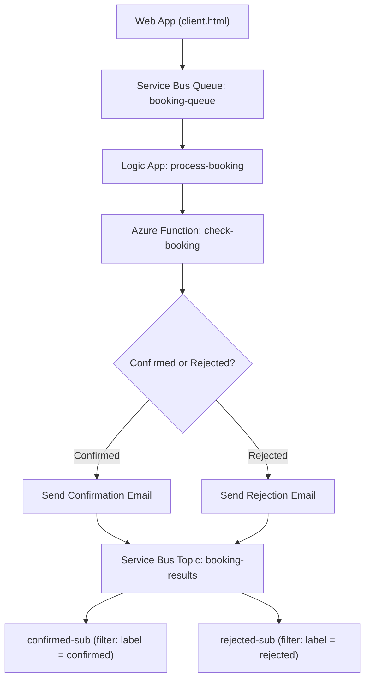

**Name:** Divyang Lodariya  
**Lab 3**  

# FleetBook - Vehicle Booking System 

### CST8917 – Serverless Applications | Lab 3

Hi! This is my Lab 3 project for **CST8917**. In this lab I built **FleetBook**, a small car-booking system on Azure. It uses **Azure Service Bus**, a **Logic App**, and an **Azure Function** working together. When a customer books a car, the system checks if a car is available, calculates the price, and emails them a **confirmation** or a **rejection**.

---

## 🎥 Demo Video

▶️ **[Watch the FleetBook demo on YouTube](PASTE_YOUR_YOUTUBE_LINK_HERE)**

In the video I show:

- The Service Bus **queue, topic, and both filtered subscriptions**
- A **confirmed** booking + the confirmation email
- A **rejected** booking + the rejection email
- The **Logic App run history** for both (True branch and False branch)
- The **topic subscription message counts**


---

##  What this project does

A customer fills out a form on a web page to book a car. Here is what happens behind the scenes:

1. The booking is sent to a **Service Bus queue** - think of it like a mailbox that holds messages.
2. A **Logic App** is watching that queue. When a booking arrives, it picks it up.
3. The Logic App calls an **Azure Function**. The function looks at the fleet (10 cars) and checks if the requested car is available in that city, then calculates the price.
4. The Logic App reads the answer and makes a decision:
   - If a car is available → **confirmed** → send a **confirmation email**  
   - If no car is available → **rejected** → send a **rejection email**  
5. The result is also published to a **Service Bus topic**. The topic has two subscriptions with filters, so confirmed results go to `confirmed-sub` and rejected results go to `rejected-sub`.

That's the whole idea: a booking comes in → it gets processed → the customer gets an email → the result is sorted into the right place.

---

## 🗺️ Architecture



---

##  Azure services I used

| Service | What it does here |
|--------|-------------------|
| Service Bus **Queue** (`booking-queue`) | Holds incoming booking requests |
| Service Bus **Topic** (`booking-results`) | Publishes the final result |
| **Subscriptions** (`confirmed-sub`, `rejected-sub`) | Use SQL filters on the label to route each result to the right place |
| **Azure Function** (`check-booking`) | Checks car availability and calculates the price |
| **Logic App** (`process-booking`) | The "brain" that connects everything and decides confirm vs reject |
| **Office 365 Outlook** | Sends the confirmation and rejection emails |
| **Web client** (`client.html`) | Simple web page to submit a booking and see the result |

---

##  Files in this repo

| File | What it is |
|------|-----------|
| `function_app.py` | The Azure Function code (availability check + pricing) |
| `requirements.txt` | Python packages the function needs |
| `test-function.http` | Test requests for the function (using the REST Client extension) |
| `client.html` | The FleetBook web page |
| `local.settings.example.json` | Example settings file with placeholder values (no real keys) |
| `README.md` | This file |

---

## ▶️ How to run it

### 1. Test the Azure Function locally
```bash
python -m venv .venv
.venv\Scripts\Activate.ps1      # Windows PowerShell
pip install -r requirements.txt
func start
```
Then open `test-function.http` in VS Code and click **Send Request** on each test.

### 2. Deploy the Function to Azure
In VS Code, use the **Azure Functions** extension → **Deploy to Function App**.

### 3. Open the web client
The browser blocks direct calls to Service Bus (a security rule called **CORS**). For the lab demo, I opened the client in a Chrome window with security turned off:
```bash
chrome.exe --disable-web-security --user-data-dir="C:\chrome-cors-test"
```
Then I opened `client.html`, entered my Service Bus **namespace** and **Primary Key**, and submitted a booking.

>  **Important:** In a real app you would **never** put a key in the browser or turn off CORS. You would use a small backend API instead. This trick is only for the lab demo.

---

##  Security note

I did **not** upload any real keys. My `local.settings.json` and SAS keys are kept private. This repo only contains `local.settings.example.json` with placeholder values.

---


##  What I learned

- How **Service Bus** queues and topics work, and how **SQL filters** route messages by their label.
- How a **Logic App** can run a workflow with a **condition** and two different branches.
- How to call an **Azure Function** from a Logic App and use its response to make a decision.
- A real-world problem: the browser **CORS** block when calling Service Bus directly - and why using a backend API is the proper fix.

---

Thanks for reading! 🚀